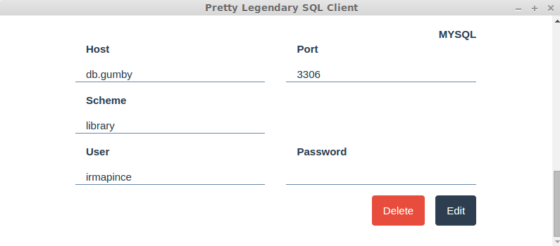

# Pretty Legendary SQL Client

Pretty Legendary SQL Client is graphical SQL client that allows you to query multiple databases at once.

Once connections to databases have been configured, [pl-sql-client](https://github.com/kyle-ilantzis/pl-sql-client) sends a query to all configured connections and displays the results.

[pl-sql-client](https://github.com/kyle-ilantzis/pl-sql-client) will help you retrieve and compare your data quickly between various schemas in your infrastructure.


## Building from source

### Dependencies
 * [Node v4.2.1](https://nodejs.org/en/)

### Quick start
1. Clone the repository
```
git clone git@github.com:kyle-ilantzis/pl-sql-client.git
 ```
2. Install Dependencies
```
npm install
 ```
3. Install gulp globally
```
npm install -g gulp
 ```
4. Launch default gulp task
```
gulp
```

## Download

* [Releases page](https://github.com/kyle-ilantzis/pl-sql-client/releases)

## Features

 * Execute queries on multiple databases
  * Postgres
  * MySQL

 * Configuring a set of databases

 



 * History of executed queries


 * Mutiple themes

 


... and many more!

## Limitations

 * Only 'select' statement is currently supported. Run update and delete at your own risk. [Related issue](https://github.com/kyle-ilantzis/pl-sql-client/issues/9)
 * Credentials are saved in clear text.

## License

GPL-3.0, see [LICENSE](LICENSE) file.
