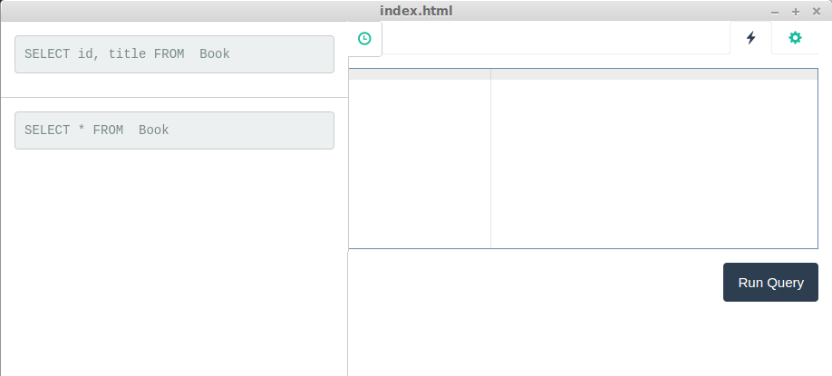

# Pretty Legendary SQL Client

Pretty Legendary SQL Client is graphical SQL client that allow you to query multiple database at once.

Once your connection to database are configured, the software will take care to send asked query to all configured connection and display the result.

That software will help you retrieves and compare quickly your data between various schema in your infrastructure.


## Building from source

### Dependencies
 * [Node v4.2.1](https://nodejs.org/en/)

### Quick start
1. Clone the repository
```
git clone git@github.com:kyle-ilantzis/pl-sql-client.git
 ```
2. Install Dependencies
```
npm install
 ```
3. Install gulp globally
```
npm install -g gulp
 ```
4. Launch default gulp task
```
gulp
```

## Download

* [Releases page](https://github.com/kyle-ilantzis/pl-sql-client/releases)

## Features

 * Executing query on multiple database
  * Postgres
  * MySQL

   

 * Configuring a set of database

 



 * History of executed queries


 * Mutiple themes

 


... and many more!

## Limitation

 * Only 'select' statement are currently supported. Run update and delete at your own risk. [Related issue](https://github.com/kyle-ilantzis/pl-sql-client/issues/9)
 * Credentials are saved in clear text.

## License

GPL-3.0, see [LICENSE](LICENSE) file.
